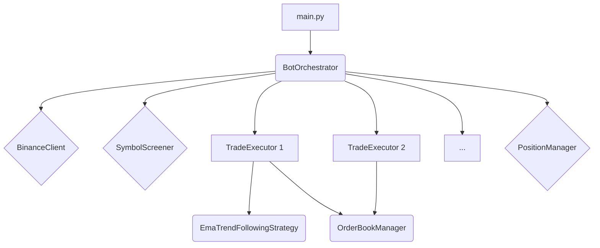

# Огляд Архітектури

Цей документ описує високорівневу архітектуру торгового бота QuantumTrader. Розуміння взаємодії ключових компонентів є важливим для подальшої розробки та підтримки системи.

## Схема потоку даних (Data Flow)

Наведена нижче схема ілюструє, як дані та команди рухаються між основними компонентами системи.

```text
+--------------------+
|   Binance Server   |
+--------------------+
         | (WebSocket: Order Book, Trades, Klines)
         | (REST API: Place/Cancel Orders, Account Info)
         v
+--------------------+
|   BinanceClient    | (Обгортка над API)
+--------------------+
         ^      |
         |      v
+--------------------+-------------------------+-----------------------+
| TradeExecutor      |    OrderbookManager     |   PositionManager     |
| (Виконання угод)   | (Керування стаканом)    | (Відстеження позицій) |
+--------------------+-------------------------+-----------------------+
         ^                    |                         ^
         | (Сигнал на          | (Дані стакану,          | (Оновлення
         |  вхід/вихід)        |  свічки)                |  статусу позиції)
         |                    v                         |
+----------------------------------------------------------------------+
|                               Strategies                               |
| (EmaTrendFollowingStrategy, DynamicOrderbookStrategy, і т.д.)         |
|   - Аналізують ринкові дані                                            |
|   - Генерують торгові сигнали                                          |
+----------------------------------------------------------------------+
         ^
         | (Координує все, передає дані стратегіям)
         |
+--------------------+
|   BotOrchestrator  | (Центральний координатор)
+--------------------+

```

## Основні компоненти

Система складається з кількох основних модулів, кожен з яких виконує свою специфічну роль. Координацією всіх компонентів займається `BotOrchestrator`.



### 1. `main.py`

*   **Призначення:** Головна точка входу в додаток.
*   **Функції:**
    *   Налаштовує логер.
    *   Створює екземпляр `BotOrchestrator`.
    *   Запускає асинхронний цикл програми.

### 2. `core/bot_orchestrator.py`

*   **Призначення:** "Мозок" операції. Цей клас відповідає за ініціалізацію, координацію та управління життєвим циклом всіх інших компонентів.
*   **Функції:**
    *   Завантажує конфігурацію.
    *   Ініціалізує `BinanceClient` для взаємодії з біржею.
    *   Запускає `SymbolScreener` для динамічного відбору торгових пар.
    *   Створює та керує екземплярами `TradeExecutor` для кожної пари "символ-стратегія".
    *   Запускає та керує слухачами ринкових даних та даних користувача.
    *   Керує кешем K-ліній (`kline_data_cache`).

### 3. `core/trade_executor.py`

*   **Призначення:** Виконавець угод для однієї конкретної торгової пари.
*   **Функції:**
    *   Містить у собі екземпляр конкретної стратегії (напр., `EmaTrendFollowingStrategy`).
    *   Постійно моніторить ринкові дані та K-лінії з кешу.
    *   Викликає метод `check_signal()` стратегії для пошуку торгових сигналів.
    *   Якщо сигнал отримано, ініціює відкриття позиції.
    *   Керує коригуванням відкритих позицій (напр., Trailing Stop Loss).

### 4. `strategies/`

*   **Призначення:** Тут міститься найголовніше — торгова логіка. Кожна стратегія є ізольованим модулем.
*   **Функції:**
    *   `check_signal()`: Основний метод, який аналізує дані (свічки, стакан, індикатори) і повертає сигнал на вхід.
    *   `calculate_sl_tp()`: Метод для розрахунку рівнів Stop Loss та Take Profit.

### 5. `core/position_manager.py`

*   **Призначення:** Відстежує всі відкриті позиції.
*   **Функції:**
    *   Зберігає інформацію про відкриті угоди.
    *   Зберігає стан позицій у файл для відновлення після перезапуску.
    *   Періодично звіряє свій стан з реальним станом на біржі.

### 6. `core/orderbook_manager.py`

*   **Призначення:** Управляє локальною копією біржового стакану для одного символу.
*   **Функції:**
    *   Підписується на потік даних `depth` через WebSocket.
    *   Підтримує актуальний стан стакану.
    *   Надає швидкий доступ до цін Bid/Ask.

### 7. `core/binance_client.py`

*   **Призначення:** Зручна обгортка для роботи з API Binance.
*   **Функції:**
    *   Спрощує асинхронні виклики до API.
    *   Містить методи для роботи з ордерами, балансом, інформацією про символи тощо.


### 9. `core/symbol_screener.py`

*   **Призначення:** Модуль для динамічного відбору найбільш ліквідних та волатильних торгових інструментів, якщо вони не задані вручну.
