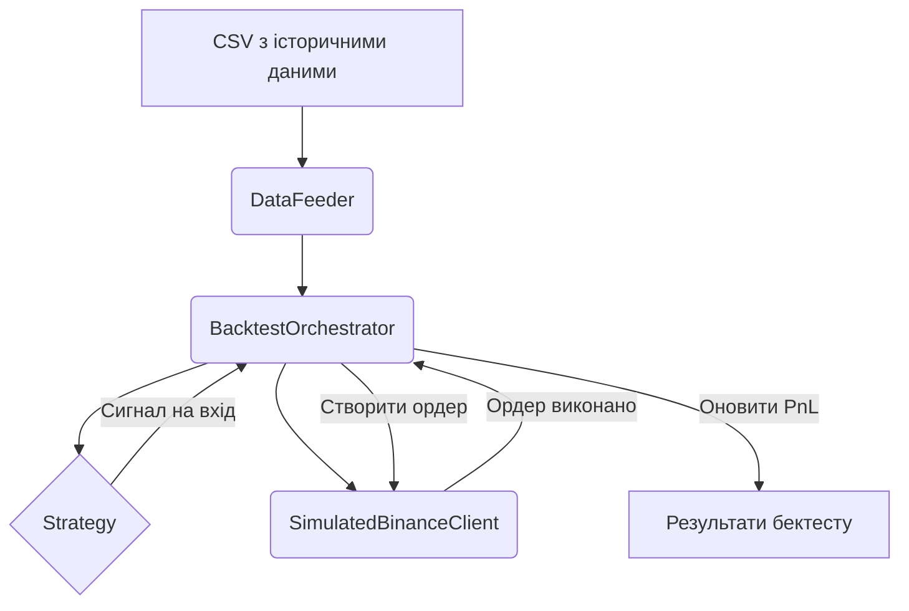

# Бектестінг

В директорії `backtesting/` знаходиться фреймворк для тестування стратегій на історичних даних.

## Схема процесу

## Компоненти

- **`backtester.py`**: Містить ключові класи:
    - **`DataFeeder`**: Читає історичні дані угод з CSV файлу.
    - **`SimulatedBinanceClient`**: Імітує роботу API Binance, включаючи створення/скасування ордерів, розрахунок комісій та прослизання.
    - **`BacktestOrchestrator`**: Головний клас, що запускає процес бектесту для конкретної стратегії та набору даних, імітуючи роботу реального `BotOrchestrator`.
- **`run_backtest.py`**: Скрипт для запуску бектесту з командного рядка.
